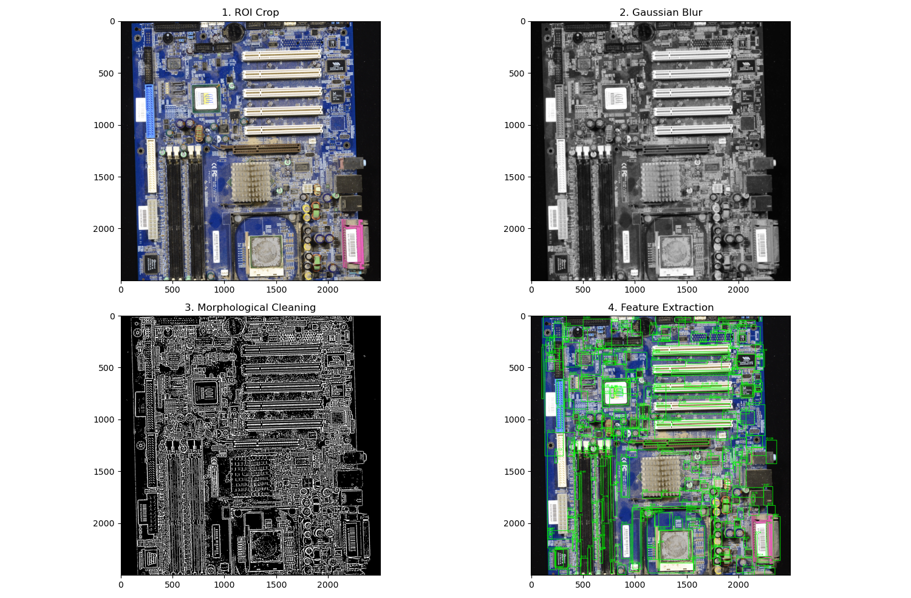

# Automated Optical Inspection (AOI) - Scientific Feature Extractor

## Project Overview

This project focuses on the development of an **Automated Optical Inspection (AOI)** pipeline designed to identify, isolate, and quantify physical components within scientific imagery (e.g., PCB scans, microscopic samples). By utilizing **OpenCV** and **Matplotlib**, the system converts raw visual data into a structured quantitative report.

This project was developed as a demonstration of proficiency in **Computer Vision and Image Processing (Track C2)** for research applications.

## Key Engineering Features

* **Region of Interest (ROI) Isolation**: Implements manual coordinate slicing to eliminate environmental noise and focus computational resources on the primary subject (e.g., the PCB surface).
* **Signal Cleaning & Morphological Processing**: Employs **Gaussian Blurring** and **Morphological Opening** ($cv2.MORPH\_OPEN$) to suppress "salt and pepper" noise and sensor artifacts.
* **Adaptive Signal Segmentation**: Utilizes **Adaptive Gaussian Thresholding** to handle uneven lighting conditions, a common challenge in laboratory and industrial environments.
* **Quantitative Spatial Analysis**: Calculates physical properties including **Area**, **Perimeter**, and **Centroid (Center of Mass)** using image moments.
* **Spatial Calibration**: Converts pixel-level data into physical units (mm) based on a defined pixel-to-unit ratio.

## Technical Stack

* **Language**: Python
* **Libraries**: OpenCV (Headless), NumPy, Matplotlib, Pandas
* **Environment**: Developed and tested on **Arch Linux** using a stable **NumPy 1.26.4** and **OpenCV 4.9.0** stack to ensure compatibility with scientific research libraries like SciPy and Numba.

## Visual Pipeline Analysis

*The 4-pane output demonstrates the progression from raw image acquisition to refined feature extraction.*

## Data Output Sample

The system generates a `pcb_analysis.csv` file, providing coordinates and measurements suitable for robotic actuation (e.g., pick-and-place tasks for a **SCARA robotic arm**).

| Feature_ID | Area_mm2 | Centroid_X | Centroid_Y |
| --- | --- | --- | --- |
| 1 | 124.50 | 1850 | 450 |
| 2 | 89.12 | 2100 | 1200 |
| 3 | 345.67 | 1550 | 2800 |

## Connection to Mechatronics & Robotics

This vision system serves as the "eyes" for automated hardware projects. The calculated **Centroid** coordinates are designed to be exported as target vectors for:

* **SCARA Robotic Arms**: Automated pick-and-place of components.
* **CNC Plotters**: Precision path generation for projects like **Linecraft Studios**.

## Installation & Usage

1. Clone the repository.
2. Install dependencies:
```bash
pip install -r requirements.txt

```


3. Run the extractor:
```bash
python src/feature_extractor.py

```
## Output Image


